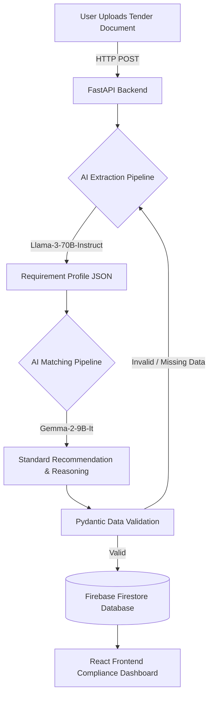

# 🇮🇳 BharatStandards AI

**BharatStandards AI** is an advanced, enterprise-grade AI procurement assistant designed to revolutionize how government entities and private contractors interface with the Bureau of Indian Standards (BIS). 

By ingesting unstructured, highly technical, and often multi-page tender documents, BharatStandards AI autonomously extracts structured requirement profiles (identifying products, materials, quantities, and testing requirements). It then utilizes a highly specialized AI inference pipeline to intelligently recommend the exact normative Indian Standard (IS) code required for compliance.

This system effectively eliminates thousands of hours of manual standard lookups, drastically reduces compliance errors, and accelerates the procurement pipeline for national infrastructure and public goods.

---

## 👥 Target Users

BharatStandards AI is built for three primary stakeholders in the procurement ecosystem:

1. **Government Procurement Officers (Tender Creators)**
   - *Use Case*: Before publishing a tender, officers can run their drafts through the AI to automatically verify that the correct and active BIS standards for safety, material quality, and testing are mandated in the contract.
2. **Private Contractors & Bidders (Tender Responders)**
   - *Use Case*: Instantly analyze complex tender documents to understand the precise IS codes, laboratory testing protocols, and product certifications required to successfully qualify for bids.
3. **Quality Assurance & Compliance Teams (Auditors)**
   - *Use Case*: Cross-reference product specifications and factory outputs with active normative Indian Standards to ensure flawless compliance and generate canonical evidence for audits.

---

## 🚀 Key Features & Benefits

- **Zero-Touch Document Analysis**: Converts 100-page unstructured PDF/Text tenders into highly structured, schema-validated JSON requirement profiles in a matter of seconds.
- **Context-Aware Precision Matching**: Uses state-of-the-art LLMs (Large Language Models) to extract deeply embedded, nuanced context (such as environmental application, precise dimensions, and specific material grades) and maps them to exact BIS Standard numbers.
- **National Risk Mitigation**: Ensures all public infrastructure and procurement materials are legally compliant with National Standards, actively preventing catastrophic safety or structural failures due to sub-standard materials.
- **Auditable Canonical Evidence**: Generates a verifiable, immutable evidence trail for every matched standard and dynamically stores it securely on the cloud via Firestore for future audits.

---

## 🛠️ Tech Stack & Technologies

The platform is built on a modern, decoupled architecture designed for high availability and rapid AI inference:

### **Frontend (Client Application)**
- **Framework**: React 18 with TypeScript and Vite for ultra-fast HMR.
- **Styling & UI**: TailwindCSS paired with custom Shadcn UI components for a premium, accessible, and highly responsive user interface.
- **Routing & State**: React Router for SPA navigation.

### **Backend (API Services)**
- **Framework**: Python 3.10+ running FastAPI and Uvicorn.
- **Async I/O**: `httpx` for non-blocking, highly concurrent external API calls.
- **Validation**: Pydantic for strict JSON schema enforcement.

### **AI & Machine Learning (The Pipeline)**
- **Extraction Engine**: **Meta Llama-3-70B-Instruct** (Served via NVIDIA NIM endpoints) — Responsible for robust natural language understanding and extracting the structured `RequirementProfile`.
- **Intelligence Matching Engine**: **Google Gemma-2-9B-It** (Served via NVIDIA NIM endpoints) — Responsible for matching the extracted profile against the vast database of Indian Standards to output the final recommendation.
- *(Note: The system also features a local, experimental "Pro Pipeline" running a custom fine-tuned Qwen model for offline, singular-model trials).*

### **Database & Cloud Storage**
- **Canonical Storage**: Google Firebase (Firestore) NoSQL database for storing structured AI recommendations and compliance evidence.

---

## ⚙️ System Architecture & Inference Pipeline

BharatStandards AI utilizes a multi-step AI inference pipeline to guarantee absolute accuracy, prevent hallucinations, and ensure strict output structuring:

1. **Document Ingestion & Normalization**: The raw, unstructured tender document is ingested via the React frontend and securely transmitted to the FastAPI backend, where it is normalized and truncated to fit context windows.
2. **Extraction Phase (Llama-3-70B)**: The primary heavyweight LLM analyzes the raw text to extract a heavily structured `RequirementProfile`. This profile categorizes the product, its intended application, quantities, material constraints, and required testing certificates.
3. **Intelligence Matching Phase (Gemma-2-9B)**: The structured profile is then passed as context to the specialized standard-matching LLM. By focusing only on the structured data rather than the noisy raw document, the AI achieves highly accurate standard recommendations.
4. **Validation & Storage**: The final recommendation is parsed from the LLM response, validated against strict Pydantic schemas, and securely committed to Firebase Firestore as a "Canonical Evidence" block.

### 📊 System Flow Diagram



---

## 📋 Prerequisites

Before running the project locally, ensure you have the following installed and configured:
- **Node.js**: v18.0.0 or higher
- **Python**: 3.10 or higher
- **API Keys**: 
  - NVIDIA API Key (Required for Llama/Gemma cloud inference)
  - Firebase Service Account Key JSON (Required for Firestore database access)
- **Package Managers**: `npm` and `pip`

---

## 🚀 How to Run Locally

### 1. Clone the Repository
```bash
git clone https://github.com/AakshayDhoke-lang/BharatStandards_Ai.git
cd BharatStandards_Ai
```

### 2. Set Up Environment Variables
Create a `.env` file in the root directory (you can use `.env.example` as a template):
```ini
VITE_FIREBASE_PROJECT_ID=your_firebase_project_id
NVIDIA_API_KEY=nvapi-your-key-here
# Ensure your firebase-adminsdk-xxx.json is placed in the root directory for backend authentication
```

### 3. Install Dependencies
```bash
# Install frontend dependencies
npm install

# Install backend dependencies (Using a virtual environment is highly recommended)
cd backend
python -m venv venv
# Windows: venv\Scripts\activate | Mac/Linux: source venv/bin/activate
pip install -r requirements.txt
cd ..
```

### 4. Start the Application (Full Stack)
The project utilizes the `concurrently` package to boot both the React frontend (Vite) and the FastAPI backend (Uvicorn) simultaneously in a single terminal instance.
```bash
npm run dev:full
```

### 5. Access the Application
- **Frontend UI Dashboard**: `http://localhost:8080`
- **Backend API & Swagger Docs**: `http://127.0.0.1:8000/docs`

---

## 🌍 Live Deployment

An attempt to host the application in a serverless environment has been successfully deployed. The frontend is hosted securely via Firebase Hosting, while the Python API backend runs serverlessly on Vercel.

**Access the Live Project Here:**
👉 **[https://bharatstandards-ai.web.app/](https://bharatstandards-ai.web.app/)**
