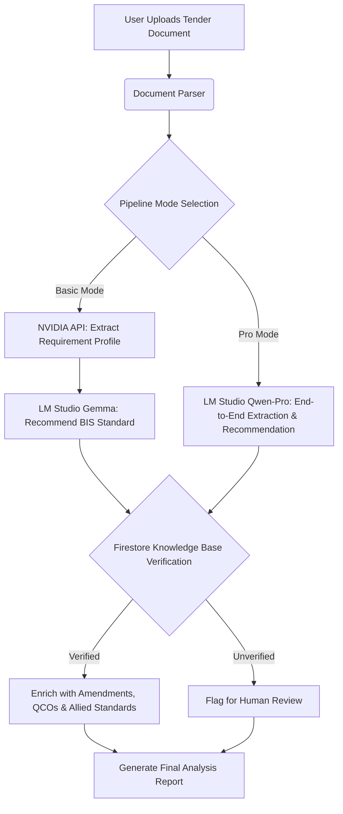

# BharatStandards AI

BharatStandards AI is an intelligent procurement assistant designed to analyze government tender documents and accurately map them to the correct Bureau of Indian Standards (BIS) specifications. By automating the requirement extraction and standards-matching process, it reduces manual errors, ensures regulatory compliance, and streamlines the procurement lifecycle.

## Pipeline & Architecture

BharatStandards AI supports a robust dual-pipeline architecture to process tender documents:

1. **Basic Pipeline (NVIDIA + Gemma)**
   - **Extraction:** Leverages NVIDIA's `meta/llama-3.2-11b-vision-instruct` to extract a structured `RequirementProfile` from raw tender text.
   - **Recommendation:** Uses a local Gemma model (via LM Studio) to analyze the requirement profile and recommend the most appropriate Indian Standard.
   
2. **Pro Pipeline (Solo Qwen)**
   - **End-to-End Processing:** Routes raw tender text directly to a local, fine-tuned `Qwen-3-4B-Pro` model running via LM Studio. This model handles both the extraction of the requirement profile and the BIS standard recommendation in a single unified step, providing built-in reasoning and higher accuracy for specialized queries.

Both pipelines ultimately cross-reference the AI's recommendations against a deterministic, Firestore-backed knowledge base to verify the standard's existence, status, and related certifications (QCOs, amendments).

### Architecture Flow Diagram



## How to Run the Project

### Prerequisites
- Node.js (v18 or higher)
- Python (3.10 or higher)
- LM Studio (Installed and running on `http://127.0.0.1:1234/v1`)
- Firestore/Firebase configured (Credentials in `.env`)
- NVIDIA API Key (for Basic Pipeline)

### 1. Environment Setup

Create a `.env` file in the root directory and configure the following:

```env
# Frontend
VITE_API_BASE_URL=http://localhost:8000
VITE_DEMO_MODE=true

# Backend (NVIDIA)
NVIDIA_API_KEY=your_nvidia_api_key_here
NVIDIA_BASE_URL=https://integrate.api.nvidia.com/v1

# Backend (Local LLM)
LM_STUDIO_BASE_URL=http://127.0.0.1:1234/v1

# Firebase
FIREBASE_PROJECT_ID=your_project_id
FIREBASE_CLIENT_EMAIL=your_client_email
FIREBASE_PRIVATE_KEY="your_private_key"
```

### 2. Install Dependencies

**Frontend:**
```bash
npm install
```

**Backend:**
```bash
pip install -r backend/requirements.txt
```

### 3. Start the Application

The project uses `concurrently` to run both the Vite frontend and the Python backend simultaneously.

```bash
npm run dev:full
```

- **Frontend** will be available at: `http://localhost:5173`
- **Backend API** will be available at: `http://localhost:8000`

### 4. LM Studio Configuration
- Ensure LM Studio is open.
- Load either your Gemma model (for Basic mode) or your `Qwen2.5-3B-Instruct.Q8_0.gguf` model (for Pro mode).
- Start the Local Server in LM Studio on port `1234`.
- In the BharatStandards AI application, go to **Settings** and toggle your desired Pipeline Mode.
