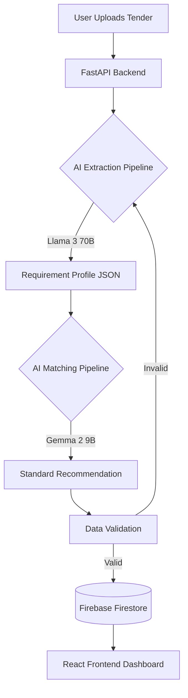

# BharatStandards AI

BharatStandards AI is an advanced, AI-driven procurement assistant designed to automatically extract structured requirement profiles from unstructured tender documents and intelligently recommend the most accurate Bureau of Indian Standards (BIS) code. 

By automating the alignment of government and private tenders with Indian Standards, BharatStandards AI eliminates manual standard lookups, reduces compliance errors, and accelerates the procurement pipeline.

## 👥 Users
- **Government Procurement Officers**: Easily verify that incoming and outgoing tenders mandate the correct BIS standards for safety, material quality, and testing.
- **Private Contractors & Bidders**: Instantly analyze tender documents to understand the precise IS codes and certifications required to qualify for bids.
- **Quality Assurance & Compliance Teams**: Cross-reference product specifications with active normative Indian Standards to ensure flawless compliance.

## 🚀 Benefits
- **Zero-Touch Analysis**: Converts 100-page unstructured PDF/Text tenders into highly structured JSON profiles in seconds.
- **Precision Matching**: Uses state-of-the-art LLMs (Large Language Models) to extract nuanced context (application, dimensions, materials) and map them to exact BIS Standard numbers.
- **Risk Mitigation**: Ensures all public infrastructure and procurement materials are legally compliant with National Standards, preventing catastrophic safety failures.
- **Auditable Evidence**: Generates a canonical, verifiable evidence trail for every matched standard stored securely on the cloud.

## 🛠️ Tech Stack
- **Frontend**: React, TypeScript, Vite, TailwindCSS (Shadcn UI components)
- **Backend**: Python, FastAPI, Uvicorn, HTTPX
- **AI / ML**: NVIDIA NIM endpoints (Llama-3-70B-Instruct for Extraction, Google Gemma-2-9B-It for Standard Matching)
- **Database**: Firebase (Firestore) for Canonical Evidence storage

## ⚙️ Architecture & Pipeline

BharatStandards AI utilizes a multi-step AI inference pipeline to guarantee accuracy and reduce hallucination:

1. **Document Ingestion**: The raw, unstructured tender document is ingested and normalized.
2. **Extraction (Llama-3-70B)**: The primary LLM analyzes the text to extract the `RequirementProfile` (Products, Application, Quantities, Testings).
3. **Intelligence Matching (Gemma-2-9B)**: The structured profile is passed to the specialized standard-matching LLM, which recommends the most accurate Indian Standard (IS).
4. **Validation & Storage**: The recommendation is parsed, validated against the schema, and securely stored in Firebase Firestore as a Canonical Evidence block.

*(Note: The system also features a local, experimental "Pro Pipeline" running a custom fine-tuned model for offline trials).*

### 📊 Flow Diagram



## 📋 Requirements
- **Node.js**: v18+ 
- **Python**: 3.10+
- **API Keys**: 
  - NVIDIA API Key (for Llama/Gemma inference)
  - Firebase Service Account Key (for Firestore)
- **Package Managers**: `npm` and `pip`

## 🚀 How to Run Locally

1. **Clone the Repository**
   ```bash
   git clone https://github.com/AakshayDhoke-lang/BharatStandards_Ai.git
   cd BharatStandards_Ai
   ```

2. **Set Up Environment Variables**
   Create a `.env` file in the root directory based on `.env.example`:
   ```ini
   VITE_FIREBASE_PROJECT_ID=your_project_id
   NVIDIA_API_KEY=nvapi-your-key-here
   # Ensure your firebase-adminsdk-xxx.json is placed in the root directory
   ```

3. **Install Dependencies**
   ```bash
   # Install frontend dependencies
   npm install

   # Install backend dependencies (a virtual environment is recommended)
   cd backend
   pip install -r requirements.txt
   cd ..
   ```

4. **Start the Application (Full Stack)**
   The project uses `concurrently` to boot both the React frontend and the FastAPI backend simultaneously.
   ```bash
   npm run dev:full
   ```

5. **Access the Application**
   - Web UI: `http://localhost:8080`
   - Backend API: `http://127.0.0.1:8000`
